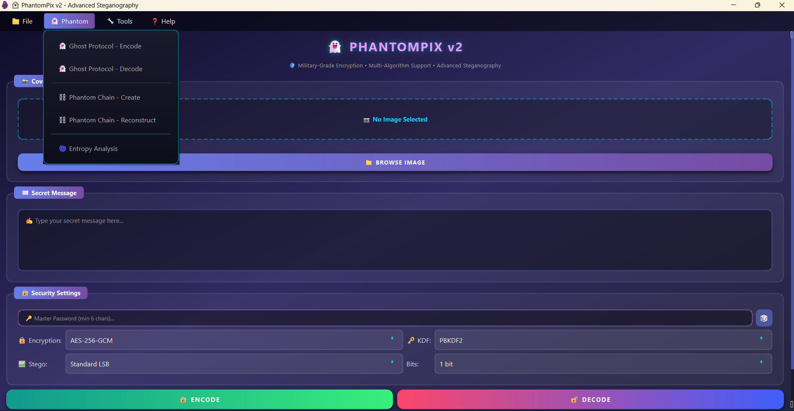

# 👻 PhantomPix v2.0 - Advanced Steganography Tool

<div align="center">




**Hide Messages in Plain Sight • Military-Grade Encryption • Advanced Covert Operations**

[Features](#-features) • [Installation](#-installation) • [Usage](#-usage) • [Phantom Core](#-phantom-core) • [Security](#-security)

</div>

---

## 🎯 Overview

PhantomPix v2.0 is a cutting-edge steganography application that combines advanced cryptography with state-of-the-art steganographic techniques. Hide encrypted messages inside images using multiple sophisticated methods including LSB embedding, entropy-aware hiding, and distributed secret sharing.

**2026 Edition Features:**
- 🔐 Multiple encryption algorithms (AES-GCM, ChaCha20-Poly1305, Fernet)
- 👻 Ghost Protocol - Plausible deniability with decoy layers
- 🔗 Phantom Chain - Distributed multi-image secret sharing
- 🌊 Entropy Weaver - Adaptive statistical camouflage steganography
- 📁 File encryption capabilities
- 🔑 Advanced key management

---

## 🚀 Features

### 🔐 Multi-Algorithm Encryption
- **AES-256-GCM** - Authenticated encryption with associated data (Recommended)
- **ChaCha20-Poly1305** - Modern stream cipher with AEAD
- **Fernet** - AES-128-CBC with HMAC (Compatible with v1)

### 🗝️ Advanced Key Derivation
- **PBKDF2-SHA256** - 480,000 iterations (OWASP 2024 recommendation)
- **Argon2id** - Memory-hard function (t=3, m=64MB, p=4) - Optional, strongest

### 🖼️ Steganography Methods
- **Standard LSB** - Classic Least Significant Bit embedding
- **Random LSB** - Password-seeded random pixel selection
- **Entropy Weaving** - Adaptive hiding in high-entropy regions
- **Multi-bit encoding** - 1-4 bits per channel for capacity

### 🔮 Phantom Core - Advanced Covert Operations

#### 👻 Ghost Protocol - Plausible Deniability
Create encrypted messages with multiple decoy layers:
- **Multiple Password Layers** - Real and decoy messages in same image
- **Cryptographic Indistinguishability** - All layers appear identical
- **Forced Disclosure Protection** - Reveal decoy password when coerced
- **Zero Proof of Other Layers** - Mathematically impossible to prove other messages exist

#### 🔗 Phantom Chain - Distributed Secret Sharing
Split secrets across multiple images using Shamir's Secret Sharing (GF(256)):
- **M-of-N Threshold Recovery** - Require multiple images to reconstruct
- **No Single Point of Failure** - Individual images reveal nothing
- **Cross-Platform Distribution** - Store fragments on different platforms
- **Temporal Binding** - Fragments are cryptographically linked with timestamps

#### 🌊 Entropy Weaver - Statistical Camouflage
Intelligent embedding that adapts to image characteristics:
- **Entropy Analysis** - Maps image to identify optimal hiding regions
- **Statistical Preservation** - Maintains natural image statistics
- **Chi-Square Resistance** - Defeats statistical steganalysis
- **Adaptive Capacity** - More data in high-entropy regions, less in smooth areas
- **Auto-Enhancement** - Subtly improve low-entropy images without visible changes

### 📦 Additional Tools
- **File Encryption** - Encrypt any file type with streaming support
- **Hash Calculator** - MD5, SHA-1/256/384/512, SHA3, BLAKE2
- **Password Generator** - Cryptographically secure passwords with strength analysis
- **Digital Signatures** - RSA-PSS signatures for verification
- **Key Management** - RSA-2048/4096 key pair generation

### 🎨 Modern UI/UX
- Stunning dark theme with gradient effects
- Animated buttons with glow effects
- Real-time password strength indicator
- Image entropy analysis and capacity visualization
- Progress indicators for all operations
- Responsive layout for various screen sizes

---

## 📋 Requirements

- Python 3.13+ (recommended)
- Windows 10/11, macOS, or Linux
- 150MB disk space

---

## 💻 Installation

<div align="center">

### 📥 Download Ready-to-Use Executable

[](https://github.com/samay825/PhantomPix-v2/releases/tag/v2.0)

**No installation required! Just download and run.**

</div>


## 🎯 Usage

### Basic Encoding

1. **Select Image** - Click "Browse Image" to select a cover image (PNG recommended)
2. **Enter Message** - Type your secret message in the text area
3. **Set Password** - Enter a strong password (min 6 characters, 12+ recommended)
4. **Choose Settings** - Select encryption algorithm, KDF, and steganography method
5. **Encode** - Click "ENCODE" and save the output image

### Basic Decoding

1. **Select Encoded Image** - Browse and select the encoded image
2. **Enter Password** - Enter the password used during encoding
3. **Decode** - Click "DECODE" to reveal the hidden message

---

## 🔮 Phantom Core

### 👻 Ghost Protocol - Plausible Deniability

Create a message with multiple encryption layers - if coerced, reveal a decoy:

**Creating Ghost Messages:**
1. Navigate to **Phantom Core → Ghost Protocol**
2. Enter your **real message** and **real password**
3. Add **decoy messages** with **decoy passwords**
4. Select **deniability level**:
   - Standard: 1 decoy layer
   - Enhanced: 2 decoy layers
   - Paranoid: 3 decoy layers
   - Maximum: 4 decoy layers
5. **Encode** into cover image

**Extracting:**
- Enter ANY valid password to reveal its corresponding message
- Attacker cannot mathematically prove other layers exist

### 🔗 Phantom Chain - Distributed Secret Sharing

Split secrets across multiple images using Shamir's Secret Sharing:

**Creating a Chain:**
1. Navigate to **Phantom Core → Phantom Chain**
2. Select **multiple cover images** (3-10 recommended)
3. Set **threshold** - minimum images needed to reconstruct
4. Enter your **secret message** and **password**
5. **Create Chain** - generates encoded images

**Reconstructing:**
1. Collect at least **threshold** number of encoded images
2. Enter the **password**
3. **Reconstruct** to reveal the original message

**Example:** Create 5 fragments with threshold 3. Store on Instagram, Twitter, email, USB, cloud. Even if 2 are compromised, message remains secure.

### 🌊 Entropy Weaver - Statistical Camouflage

Analyze and optimize images for steganography:

**Image Analysis:**
1. Navigate to **Phantom Core → Entropy Weaver**
2. Select image(s) to analyze
3. View **entropy map** and **suitability score** (0-100)
4. Review **recommendations** for best results

**Embedding Strategies:**
| Strategy | When Used | Security |
|----------|-----------|----------|
| Entropy Weaving | Score ≥ 70% | Highest |
| Hybrid Mode | Score 45-70% | High |
| Enhanced LSB | Score 35-45% | Moderate |
| Standard LSB | Score < 35% | Basic |

**Auto-Enhancement:** Subtly improve low-entropy images with imperceptible noise injection.

---

## 📦 Additional Tools

### File Encryption

1. Go to **Tools → Encrypt File**
2. Select the file to encrypt
3. Enter and confirm password
4. Save the encrypted `.ppxe` file

### Hash Calculator

1. Go to **Tools → Hash Calculator**
2. Enter text or select a file
3. Choose hash algorithm (MD5, SHA-256, SHA-512, etc.)
4. Calculate and copy hash

### Password Generator

1. Go to **Tools → Password Generator**
2. Set length and character types
3. Generate cryptographically secure passwords
4. View strength analysis


## 🔒 Security

### Encryption Details

| Algorithm | Type | Key Size | Authentication |
|-----------|------|----------|----------------|
| AES-256-GCM | AEAD | 256-bit | Built-in tag |
| ChaCha20-Poly1305 | AEAD | 256-bit | Built-in tag |
| Fernet | CBC+HMAC | 128-bit | HMAC-SHA256 |

### Key Derivation

| KDF | Iterations/Cost | Salt Size | Notes |
|-----|-----------------|-----------|-------|
| PBKDF2-SHA256 | 480,000 | 32 bytes | OWASP 2024 standard |
| Argon2id | t=3, m=64MB, p=4 | 32 bytes | Memory-hard, strongest |

### Phantom Core Security

| Feature | Security Model | Protection |
|---------|---------------|------------|
| Ghost Protocol | Plausible Deniability | Coercion resistance |
| Phantom Chain | Shamir Secret Sharing | Threshold cryptography |
| Entropy Weaver | Statistical Camouflage | Steganalysis resistance |

### Capacity Calculation

**Standard LSB:**
```
Max Bytes = (Width × Height × 3) / 8 - Header
```
Example: 1920×1080 image ≈ 777 KB

**Entropy Weaving:**
```
Safe Bytes = Σ(high_entropy_region.capacity) / 8 - 32
```
Typically 30-70% of standard capacity, but significantly more secure.

### Best Practices

✅ Use PNG format (lossless compression)  
✅ Use passwords with 12+ characters  
✅ Include uppercase, lowercase, numbers, and symbols  
✅ Use Argon2id when available  
✅ Analyze images before embedding (Entropy Weaver)  
✅ Use Ghost Protocol when coercion is possible  
✅ Use Phantom Chain for distributed storage  
✅ Use high-entropy images (photographs, textures)

❌ Don't share passwords via insecure channels  
❌ Don't reuse passwords  
❌ Don't use JPEG output (lossy compression destroys data)  
❌ Don't compress/resize encoded images  
❌ Don't use low-entropy images (logos, screenshots, solid colors)

---

## 🔄 Backward Compatibility

PhantomPix v2 maintains full backward compatibility with v1:
- Automatically detects v1 format (PPX1 magic bytes)
- Falls back to v1 decryption when needed
- v1 encoded images remain fully compatible

---

## 🛠️ Technical Details

### Phantom Chain Math
Uses GF(256) Shamir's Secret Sharing:
- Polynomial evaluation in Galois Field
- Lagrange interpolation for reconstruction
- AES irreducible polynomial: x⁸ + x⁴ + x³ + x + 1

### Ghost Protocol Layers
- Each layer uses AES-256-GCM with unique salt/nonce
- PBKDF2 with 500,000 iterations per layer
- Layers are randomly shuffled (position reveals nothing)
- All layers padded to identical 4KB blocks

### Entropy Weaver Analysis
- Block-based entropy calculation (8×8 pixel blocks)
- Shannon entropy formula: H = -Σ(p * log₂(p))
- Regions with entropy ≥ 5.0 are considered suitable
- Gaussian noise injection for enhancement

---

## 📝 Changelog

### v2.0.0 (2026)
- ✨ **Phantom Core Module**
  - 👻 Ghost Protocol - Plausible deniability encryption
  - 🔗 Phantom Chain - Shamir secret sharing across images
  - 🌊 Entropy Weaver - Adaptive statistical camouflage
- ✨ Multi-algorithm encryption (AES-GCM, ChaCha20, Fernet)
- ✨ Advanced key derivation (PBKDF2, Argon2id)
- ✨ Multiple steganography methods
- ✨ File encryption with streaming
- ✨ Hash calculator tool
- ✨ Password generator with strength analysis
- ✨ Digital signatures (RSA-PSS)
- ✨ Key management (RSA-2048/4096)
- ✨ Image entropy analysis
- 🎨 Responsive UI with scroll support
- 🔧 Background workers for heavy operations
- 🔧 Better error handling
- 🔒 Enhanced security defaults

### v1.0.0 (2025)
- Initial release
- Basic LSB steganography
- Fernet encryption
- SHA256 key derivation

---

## 👤 Author

**Developed by Zork**

- GitHub: [@samay825](https://github.com/samay825/PhantomPix-v2)
- Email: sincryptzork@gmail.com

---

## ⚠️ Disclaimer

This tool is provided for educational and legitimate privacy purposes only. Users are responsible for complying with all applicable laws and regulations. The author assumes no liability for misuse of this software.

**Legal uses include:**
- Personal privacy protection
- Security research and education
- Secure communication in authorized contexts
- Data integrity verification

---

## 📄 License

MIT License - See LICENSE file for details.

---

<div align="center">

**👻 Hide Messages in Plain Sight**

Made with ❤️ by Zork

⭐ Star this repo if you find it useful!

[Report Bug](https://github.com/samay825/PhantomPix-v2/issues) • [Request Feature](https://github.com/samay825/PhantomPix-v2/issues)

</div>
